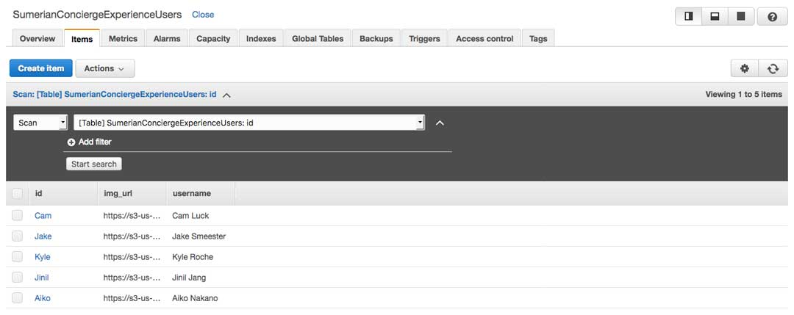
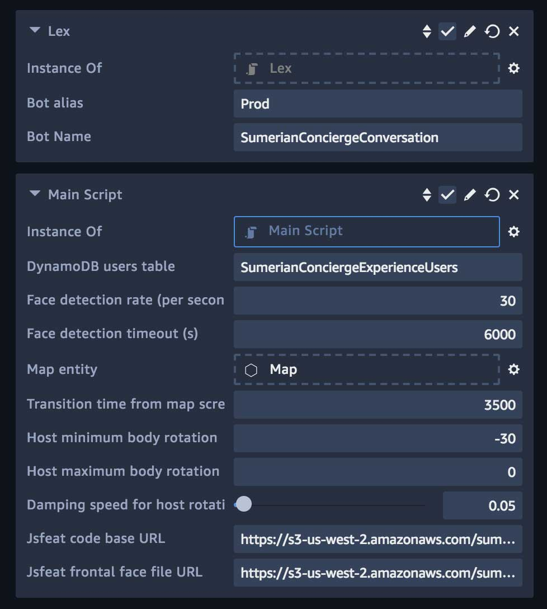

# Amazon Sumerian Virtual Concierge Starter Pack Resources

This repo contains AWS resources and source code used to create an interactive virtual concierge experience similar to the [Amazon Sumerian Concierge Experience demo](https://docs.sumerian.amazonaws.com/articles/concierge-experience/) using Amazon Sumerian. It accompanies the *VirtualConciergeStarterPack* asset pack from Amazon Sumerian's Asset Import. Please refer to the [Virtual Concierge Starter Pack](TODO: Update link after it's published) article to get started.

## Set up your AWS resources

The resources are organized by the corresponding AWS service names in the *resources* folder. We will first set up AWS services on the AWS console and then configure your Sumerian scene with them. The suggested AWS resource names below correspond to the default names we provided in the Sumerian asset pack.

### Amazon Cognito Identity Pool ID to use AWS resources
Create Amazon Cognito Identity Pool ID on the AWS Console using AWS CloudFormation. You can use the template in the *resources > cloudFormation* folder. See our [Amazon Cognito Setup Using AWS Cloudformation tutorial](https://docs.sumerian.amazonaws.com/tutorials/create/beginner/aws-setup/) for information on creating the CloudFormation stack.

### Amazon Lex for conversation bot
The voice and text-based interactions with a Sumerian Host is enabled by Amazon Lex's conversation bot. We set up multiple intents to parse different requests asked by users.

1. Download "SumerianConciergeExperience-Lex.zip" file from the *resources > lex* folder in this repo.
2. Go to the Amazon Lex console and click on **Actions** dropdown. If this is your first time using Amazon Lex, it may take you to the 'Getting started' page first. The **Actions** dro-down will be displayed once you go through these steps. 
3. Choose **Import** and upload the file you downloaded in the previous step. This will create an Amazon Lex bot called "SumerianConciergeConversation". Please see [Importing in Amazon Lex Format](https://docs.aws.amazon.com/lex/latest/dg/import-from-lex.html) for more information on importing a Lex Format. 
4. Publish the Amazon Lex bot with the alias *Prod*.

### Amazon DynamoDB users table for interactive map
When the user requests to see the floor plan in this demo, our Host shows information overlaid with her teammate’s name and photo as the user clicks on different desks. The Sumerian picking system ties click and touch events with objects in the 3D scene. The event sends the desk entity ID to our Amazon DynamoDB table to look up the username and image URL stored in Amazon S3. As you will see in the Sumerian scene setup, the desk entity name matches the primary key *id*.

1. Create a new Amazon DynamoDB table called "SumerianConciergeExperienceUsers".
2. Type "id" for your primary key and pick "String" from the dropdown.
3. Populate your database with your users' information like the below. They are all string entries. You can add items to the table by going to the **Items** tab and clicking on the **Create item** button to add *id*, *img_url*, and *username* on the AWS Console. See the next step on how to upload images to Amazon S3.
4. Please upload images to Amazon S3 by following the instructions on [Amazon S3 documentation](https://docs.aws.amazon.com/AmazonS3/latest/user-guide/upload-objects.html). Please make sure to grant public read access to your images in Amazon S3 as noted there.



## Set up your Sumerian scene
Let's configure your Sumerian scene with the AWS resources you set up above.
1. Import *VirtualConciergeStarterPack* asset pack from Amazon Sumerian's Asset Import.
2. In the **Entities** panel, select the root, or scene, entity to see the **AWS Configuration** component. Copy the Amazon Cognito Identity Pool ID and paste it into *AWS Configuration > Cognito Identity Pool ID* textbox.
3. Click on the *Main Script* entity on the **Entities** panel on the left side of the Sumerian IDE. This opens the **Inspector** panel on the right-hand side like the below. Go down to the **Script** component section to find script settings like the below. Open the **Script** component panel by clicking on its header if the script settings panel is not shown. Set the input fields for *Amazon Lex Bot Alias* and *Bot Name* as well as *DynamoDB Users Table* based on your AWS resource configuration in the previous steps. As mentioned above, we've set up the default values to match our suggested names for your convenience. 



## Note on Supported Regions for Other AWS Services

Please note the [supported regions](https://aws.amazon.com/about-aws/global-infrastructure/regional-product-services/) for Amazon Lex and Rekognition services. For example, if your region does not support Amazon Lex, you can set the region in the script component file *Lex.js* like the following: 

```javascript
const lex = new AWS.LexRuntime({region: 'us-east-1'});
```